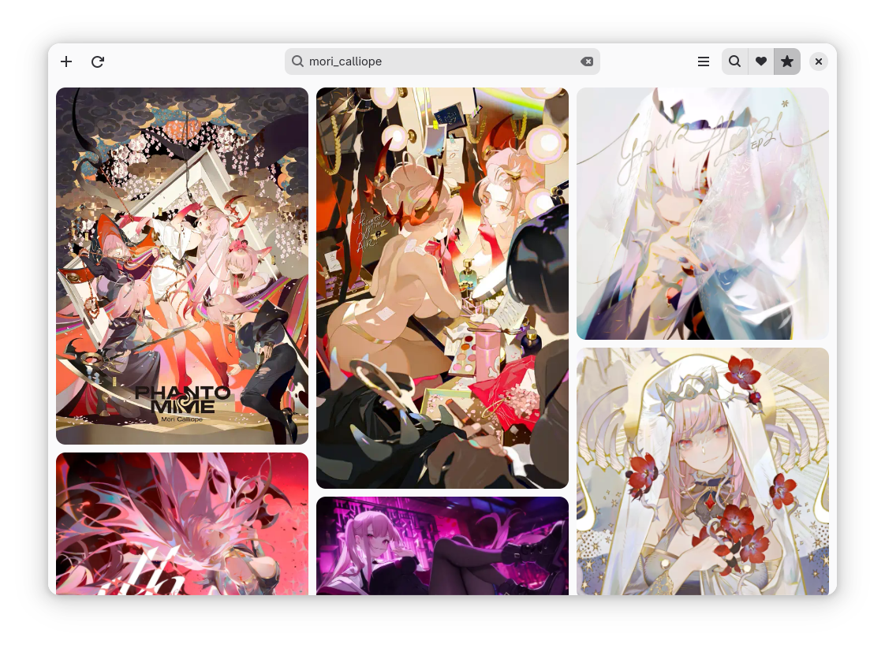

# Cardboard

Browse Danbooru and save favorites

## Description
Cardboard (name subject to change) is a browser for Danbooru that uses GTK 4 and Adwaita.

It uses a masonry/waterfall layout for the catalog of posts which is adaptable to small screens.

The main goal of this application is storing and displaying your favorites locally in a pretty way, while also being suitable for lurking.

### Features
- Adaptable UI
- Infinite scroll
- Lazy loading
- Save favorite posts
- Automatically download favorites to store and view offline
- Custom folder for storing favorites
- Save searches and have them be displayed in a single feed
- Blacklist tags
- Autocomplete search
- Restore tabs on startup
- Custom new tab
- View post info and tags and navigate through them
- Preview posts without leaving the catalog
- Download posts individually
  
## Install
### Flatpak
*TBA*

## Build
Install [GNOME Builder](https://flathub.org/apps/org.gnome.Builder)

1. Open GNOME Builder
2. Clone Repository
3. `https://github.com/12012015/Cardboard.git`
4. Run

